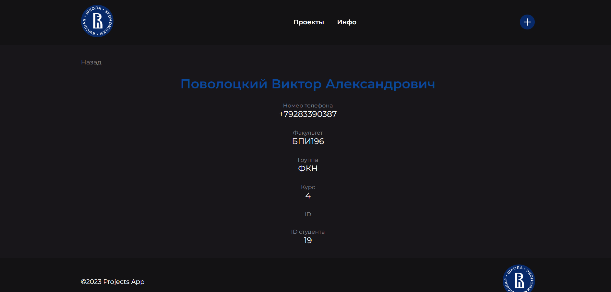

# Проект Projects App

## Реализовано:

1.  Каталог проектов
2.  Каталог информации о студентах
3.  Страницы: 
    
    - Страница с карточками проектов

      

    - Страница с карточками информации о студентах
    
      

    - Страница с полной информацией о проекте

      

    - Страница с полной информацией о студенте

      

4.  Модальное окно с функцией добавления нового проекта

      

5.  Дополнительный функционал: 
    - Адаптивная мобильная версия

      

6.  Использованные хуки:
    - useState
    - useEffect
    - useForm
    - useNavigate
    - useContext

## Использованные технологии

1. Библиотека React
2. React-router-dom (BrowserRouter, Routes, Route)
3. JavaScript (JSX)
4. Props, context
5. SCSS
6. REST API
7. Git (GitHub Pages)

## Деплой

    https://projects-app-povolotskiy.netlify.app/

## Для запуска проекта локально:

- Перейти в директорию проекта
- npm install
- Команда для запуска npm start
